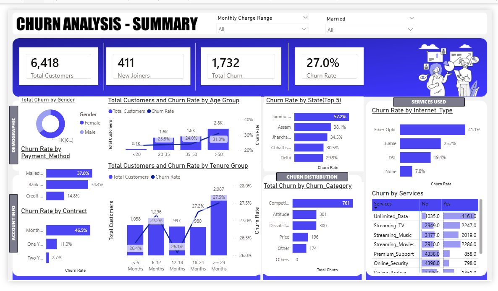
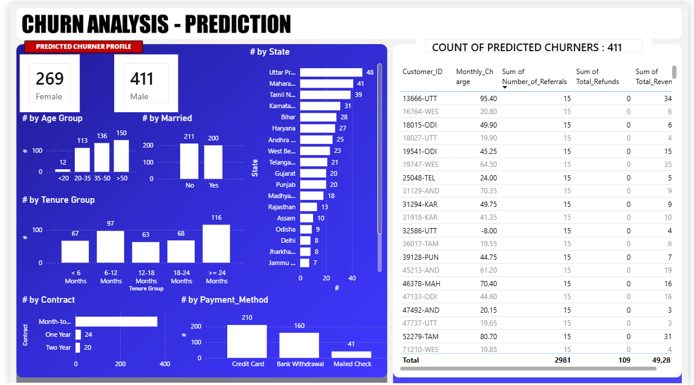

# 📉 Telecom Customer Churn Prediction & Analytics
### *End-to-End Data Pipeline: SQL Server → Python (ML) → Power BI*

  

## 🎯 Project Objective
This project aims to identify the root causes of customer attrition and build a **Machine Learning model** to predict future churners. By combining historical analysis with predictive modeling, the business can move from reactive reporting to **proactive customer retention**.

## 📊 1. Executive Summary Dashboard
This view provides a high-level overview of churn drivers across demographics, geography, and service types.

> **Key Metric:** Identified an overall churn rate of **27.0%** across a total customer base of **6,418**.

---

## 📈 2. Strategic Business Insights
Based on the data analysis, the following high-impact insights were identified for stakeholders:

* **Contractual Risk:** Customers on **Month-to-Month contracts** have the highest churn rate (**46.5%**). Transitioning these customers to 1-year or 2-year contracts could reduce churn by over 30%.
* **Service Quality:** **Fiber Optic** users churn at **41.1%**, significantly higher than DSL users (**19.4%**), suggesting technical dissatisfaction or pricing issues in the premium segment.
* **Demographic Focus:** Senior citizens and customers without dependents show higher churn propensity, requiring tailored marketing "Save" offers.

---

## 🔍 3. Predictive Analytics: At-Risk Customers
Using a **Random Forest model**, we identified current customers with a high probability of leaving.

> **Actionable Output:** The model generated a "Target List" of **411 high-risk customers**, allowing the retention team to focus their efforts where they matter most.

---

## 🛠️ Technology Stack
1.  **SQL Server:** Data cleaning, handling nulls in `Total Charges`, and creating optimized views.
2.  **Python (Jupyter Notebook):** Exploratory Data Analysis (EDA) and ML model development.
3.  **Power BI:**  DAX development, UI/UX design, and interactive filtering.

## 📂 Repository Contents
* `customer.pbix`: Interactive Power BI file.
* `Churn Prediction.ipynb`: Python code for the ML model.
* `SQLQuery1.sql`: Data transformation scripts.
* `Predictions.csv`: Final output of the ML model.

---

